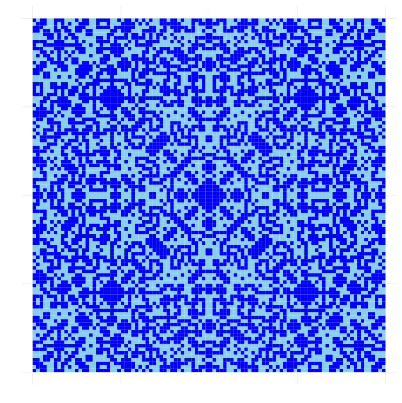
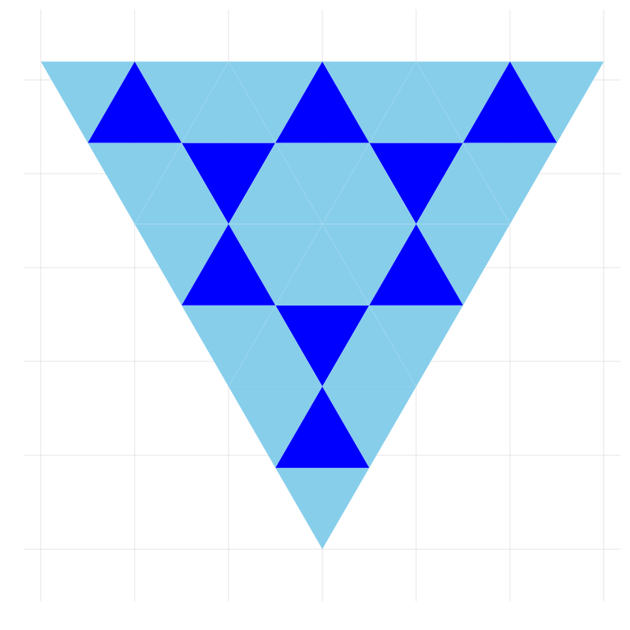

# ライツアウトパズル

## ルール

>- タイルがライトになっている。
>- クリックするとそのタイルと隣接するタイルのon-offが反転
>- 全部offにしたら完成

## 一般化

どのようなタイル張り(グラフ)の上にも定義できる。

# 解法

## 有限体${\mathbb F}_2$

>- 足し算
<table border="1">
<tr>
<td>$+$</td>
<td>$0$</td>
<td>$1$</td>
</tr>
<tr>
<td>$0$</td>
<td>$0$</td>
<td>$1$</td>
</tr>
<tr>
<td>$1$</td>
<td>$1$</td>
<td>${\color{red}0}$</td>
</tr>
</table>
 
$$
0 + 1 = 1,~~~ 1 + 1 = 0
$$

 

>- かけ算
<table border="1">
<tr>
<td>$\times$</td>
<td>$0$</td>
<td>$1$</td>
</tr>
<tr>
<td>$0$</td>
<td>$0$</td>
<td>$0$</td>
</tr>
<tr>
<td>$1$</td>
<td>$0$</td>
<td>$1$</td>
</tr>
</table>

>- 加減乗除が可能 $\Longrightarrow$ 線形代数が展開出来る。

## ${\mathbb F}_2$によるon-offの表現

$1:$ ライトがオン

$0:$ ライトがオフ

 
$$
0 + 1 = 1,~~~ 1 + 1 = 0
$$

$1$を足すことはon-off反転

タイルが$n$枚であれば、${\mathbb F}_2$上の$n$次元ベクトル
で表現できる。

## 例

## 連立方程式 {class="left"}

>- ${\mathbf S}:$ on-offの初期状態を表すベクトル

>- ${\mathbf v}_i:$ タイル$i$を押すことによる変化を表すベクトル

>- $x_i:$ タイル$i$を押すか押さないか
$$
x_i = 
\begin{cases}
1 & 押す\\
0 & 押さない
\end{cases}
$$

>- 連立方程式:
$${\mathbf S} + x_1{\mathbf v}_1 + x_2{\mathbf v}_2 + \cdots + x_n{\mathbf v}_n=0$$
 
$${x_1{\mathbf v}_1 + x_2{\mathbf v}_2 + \cdots + x_n{\mathbf v}_n=-{\mathbf S}}$$

## ラプラシアン

>- 行列
$$
L = ({\mathbf v}_1, {\mathbf v}_2, \ldots, {\mathbf v}_n)
$$
をラプラシアンと呼ぶ。

>- 連立方程式は
$$
L{\mathbf x} = {\mathbf S}
$$
と表現できる。$\Rightarrow$掃き出し法で解ける。

>- 
$${\rm corank}L = n- {\rm rank}{L}$$
が可解性や解の個数を決定する。

>-
$${\rm corank}L = 0 \Longleftrightarrow どのような初期配置も唯一つの解を持つ。$$

## ラプラシアンの$corank$

>- <a href="http://oeis.org/A159257"> On-Line Encyclopedia of Integer Sequences A159257</a>
に計算結果がある。

>- ${\rm corank}L$の研究は現在も続いている。

>- 一般の$n$に対して${\rm corank}$を明示的に表す式などは知られていない。

# 解の形状

## Sutnerの定理

>- 
K.Sutnerは1989年にどのような(グラフ上の）ライツアウトパズルも
すべてのライトが点灯している状態を初期状態とする
とき(all-one problem)、可解であることを示した。

>- 
正方形タイル張り上のライツアウトパズルについて、
全点灯から全消灯するためにクリックが
必用となるタイルを計算した結果を以下に示す。

## $n=60, {\rm corank}L=0$

</img>

## $n=80,~ {\rm corank}L=0$

</img>

## $n=100,~ {\rm corank}L=0$

</img>

## $n=120,~ {\rm corank}L=0$

</img>

## $n=140,~ {\rm corank}L=0$

</img>

## $n=151,~ {\rm corank}L=0$

</img>

## $n=61,~ {\rm corank}L=40$

</img>

# 正三角形タイル張り

## 正三角形ライツアウト

一辺の長さが$n$の正三角形を一辺の長さが
$1$の正三角形$n^2$個で敷き詰める。

</img>

## 基本解

</img>

## $n=2,~{\rm corank}L=1$

</img>
</img>

## $n=3,~{\rm corank}L=1$

</img>
</img>

## $n=4,~{\rm corank}L=2$

</img>
</img>
</img>
</img>

## $n=5,~{\rm corank}L=2$

</img>
</img>
</img>
</img>

## $n=6,~{\rm corank}L=3$

</img>
</img>
</img>
</img>
</img>
</img>
</img>
</img>

## 予想

一辺の長さ$n$の正三角形タイル張りライツアウトについては

>- all-one problemの解は$D_3$-不変
>- $${\rm corank}L=\left\lfloor\frac{n}{2}\right\rfloor$$

## $n=100,~{\rm corank}L=50$

</img>

# ペンローズタイル張り

もともとやりたかったことは誰も作っていない
ライツアウトゲームを作ること。

ペンロースタイル張り上のライツアウトは
どんなに検索しても見つからなかった。

## ペンローズタイル張りとは

>- 準周期性
>- 5回対称性
>- 5次元空間からの2次元平面への射影

## ペンローズタイル張りの構成

$$\zeta = \exp(\pi{i}/5),~~~ \varphi =\frac{1+\sqrt{5}}{2}=\zeta + \zeta^{-1}$$

$(x_0,x_1,\cdots,x_4)\in {\mathbb Z}^5$で

$x_0 + x_1\zeta + \cdots + x_4\zeta^{4}\in{\mathbb C}$を略記

## ペンローズタイル張りの構成2

Aタイプ三角形(頂角$\pi/5$、等辺長$1$)を拡大細分する。

</img>

## ペンローズタイル張りの構成3

Bタイプ三角形(頂角$3\pi/5$、等辺長$1$)を拡大細分する。

</img>

## ペンローズタイル張りの構成4

## 是非遊んで下さい。

https://pro4-12b05.firebaseapp.com/

# all-one problemの解のかたち

## 拡大回数1 corank=0

</img>

## 拡大回数2 corank=1

</img>

## 拡大回数3 corank=0

</img>

## 拡大回数4 corank=12

</img>

## 拡大回数5 corank=10

</img>

## 拡大回数6 corank=2

</img>

## 拡大回数7 corank=0

</img>

## 拡大回数8 corank=6

</img>

## 拡大回数9 corank=6

</img>

# まとめ

## 疑問

>- 正三角形ライツアウトの解はなぜ$D_3$-不変なのか？

>- ペンローズライツアウトの解の中心付近の正五角形状の塊は拡大し続ける？　
	どれぐらいの勢いで？

# ありがとうございました
	

## 調和関数

$$
{\rm Ker }L = \left\{{\bf x}\in {\mathbb F}_2^{n^2}\,\middle|\,L{\bf x} = {\bf 0}\right\}
$$

</img>
</img>
</img>
</img>
</img>
</img>
</img>
</img>
</img>
</img>

